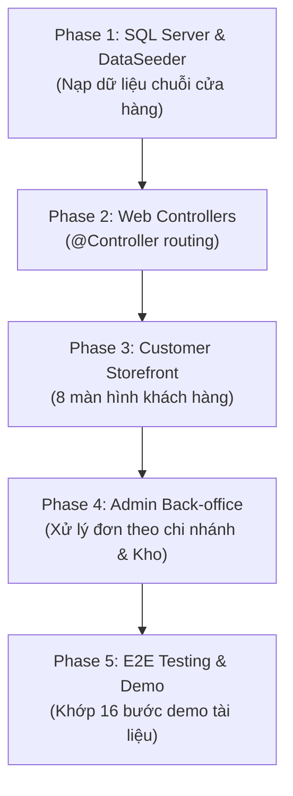

# KẾ HOẠCH HOÀN THIỆN TOÀN BỘ DỰ ÁN LUNEA (CHẠY CỤC BỘ VỚI SQL SERVER)

> **Dự án:** Website Bán Mỹ Phẩm Theo Mô Hình Chuỗi Cửa Hàng LUNEA  
> **Môn học:** Công nghệ phần mềm (CNPM)  
> **Cơ sở dữ liệu:** Microsoft SQL Server 2022 Express (`localhost:1433`, Database: `lunea`)  
> **Backend Stack:** Java 25 · Spring Boot 4.1.1 · Spring Data JPA · Spring Security (Stateless JWT Cookie) · MapStruct · Lombok  
> **Frontend Stack:** Hybrid Architecture (Thymeleaf View Templates + Vanilla CSS Tokens + Fetch API `/api/**`)  
> **Mục tiêu:** Hoàn thiện một phiên bản chạy mượt mà trên máy cục bộ, đầy đủ luồng nghiệp vụ mua hàng trực tuyến và quản trị chuỗi cửa hàng, sẵn sàng demo bảo vệ đồ án 16 bước.

---

## MỤC LỤC
1. [Tổng quan hiện trạng & Khoảng trống kỹ thuật](#1-tổng-quan-hiện-trạng--khoảng-trống-kỹ-thuật)
2. [Lộ trình triển khai 5 Giai đoạn (Master Phases)](#2-lộ-trình-triển-khai-5-giai-đoạn-master-phases)
   - [Phase 1: Hạ tầng & Dữ liệu mẫu (SQL Server + DataSeeder)](#phase-1-hạ-tầng--dữ-liệu-mẫu-sql-server--dataseeder)
   - [Phase 2: Tầng Web Controllers & Điều hướng (@Controller)](#phase-2-tầng-web-controllers--điều-hướng-controller)
   - [Phase 3: Giao diện Khách hàng (Customer Storefront - Moonlight Theme)](#phase-3-giao-diện-khách-hàng-customer-storefront---moonlight-theme)
   - [Phase 4: Giao diện Quản trị & Nhân viên Chi nhánh (Back-office)](#phase-4-giao-diện-quản-trị--nhân-viên-chi-nhánh-back-office)
   - [Phase 5: Kiểm thử E2E & Kịch bản Demo 16 bước](#phase-5-kiểm-thử-e2e--kịch-bản-demo-16-bước)
3. [Bảng theo dõi tiến độ chi tiết (Checklist theo từng File & Task)](#3-bảng-theo-dõi-tiến-độ-chi-tiết)
4. [Hướng dẫn khởi chạy cục bộ (Local Quickstart Guide)](#4-hướng-dẫn-khởi-chạy-cục-bộ-local-quickstart-guide)
5. [Kịch bản Demo bảo vệ đồ án (16 bước chuẩn)](#5-kịch-bản-demo-bảo-vệ-đồ-án-16-bước-chuẩn)

---

## 1. TỔNG QUAN HIỆN TRẠNG & KHOẢNG TRỐNG KỸ THUẬT

### 1.1. Hiện trạng đã hoàn thành (Backend Core: ~85%)
- [x] **Biên dịch & Build:** Đã cấu hình Maven chạy trên Java 25 và Spring Boot 4.1.1 (210 files mã nguồn compile thành công).
- [x] **Thực thể dữ liệu (30 Entities):** Đầy đủ các gói `account`, `catalog`, `inventory`, `returns`, `review`, `sales`.
- [x] **Kết nối SQL Server 2022 Express:** Đã thêm driver `mssql-jdbc`, kết nối thành công tới `localhost:1433/lunea` bằng tài khoản `lunea/12345`.
- [x] **Khởi tạo Database Schema:** Hibernate đã tự động sinh đủ **37 bảng dữ liệu** trên SQL Server theo đúng ERD thiết kế.
- [x] **Service Layer & Business Logic:** Đã cài đặt các Service cốt lõi (`OrderServiceImpl`, `ProductServiceImpl`, `InventoryServiceImpl`, `CartServiceImpl`, `AccountServiceImpl`, v.v.).
- [x] **Bảo mật JWT:** Cơ chế Stateless JWT qua cookie `HttpOnly` (`LUNEA_AT`), kiểm tra header `X-Requested-With`, phân quyền theo Role và Permission.
- [x] **Hệ thống REST Controller:** Đầy đủ API phục vụ dữ liệu JSON (`/api/auth`, `/api/products`, `/api/cart`, `/api/orders`, `/api/admin/**`).

### 1.2. Khoảng trống cần hoàn thiện để chạy Web cục bộ
- [x] **DataSeeder tự động:** Đã có `DataSeeder.java` nạp đủ 5 tài khoản demo, 3 chi nhánh, 5 thương hiệu, 10 sản phẩm, 16 SKUs, 48 bản ghi tồn kho và 3 voucher.
- [x] **Web Page Controllers (`@Controller`):** Đã tạo đầy đủ 7 Controller điều hướng Thymeleaf (`HomeController`, `ProductPageController`, `AuthPageController`, `CartPageController`, `CheckoutPageController`, `AccountPageController`, `AdminPageController`, `CustomErrorController`).
- [ ] **Giao diện Khách hàng (Thymeleaf Templates):** Thư mục `src/main/resources/templates/` đang trống. Cần tạo 8 màn hình khách hàng theo thiết kế Moonlight Dark Theme.
- [ ] **Giao diện Quản trị Back-office:** Cần tạo layout Admin và các trang xử lý đơn hàng theo chi nhánh, điều chỉnh tồn kho có log, quản lý sản phẩm.
- [ ] **Static Assets:** Cần tạo bảng màu CSS Tokens (`tokens.css`), client JS API wrapper (`api.js`), dữ liệu vị trí hành chính (`vn-locations.json`).

---

## 2. LỘ TRÌNH TRIỂN KHAI 5 GIAI ĐOẠN (MASTER PHASES)



---

### PHASE 1: HẠ TẦNG & DỮ LIỆU MẪU (SQL SERVER + DATASEEDER)
*Thời gian dự kiến: 0.5 ngày*  
*Mục tiêu: Khi chạy app lên SQL Server, database có đầy đủ dữ liệu mẫu để thử nghiệm mọi luồng mà không cần tạo thủ công.*

1. **Khắc phục xung đột tên cột SQL Server:**
   - Quoting các cột mang tên nhạy cảm như `value` trong `ProductAttributeValueEntity` và `SkuAttributeValueEntity` (`@Column(name = "\"value\"")`).
2. **Xây dựng `DataSeeder.java` (`CommandLineRunner`):**
   - Chỉ chạy khi bảng dữ liệu chưa có dữ liệu (tránh trùng lặp khi khởi động lại).
   - **Tài khoản demo (Mật khẩu: `123456`, hash BCrypt):**
     - `admin` (ROLE_EMPLOYEE, quyền toàn hệ thống)
     - `order_hcm` (ROLE_EMPLOYEE, nhân viên xử lý đơn Chi nhánh HCM)
     - `order_hn` (ROLE_EMPLOYEE, nhân viên xử lý đơn Chi nhánh Hà Nội)
     - `warehouse_hcm` (ROLE_EMPLOYEE, nhân viên kho Chi nhánh HCM)
     - `khach01@lunea.test` (ROLE_CUSTOMER, tài khoản khách hàng)
   - **3 Chi nhánh mẫu:**
     - Chi nhánh 1: LUNEA Quận 1 - TP. Hồ Chí Minh
     - Chi nhánh 2: LUNEA Cầu Giấy - Hà Nội
     - Chi nhánh 3: LUNEA Hải Châu - Đà Nẵng
   - **Catalog Mỹ phẩm mẫu:**
     - Thương hiệu: *The Ordinary, Cocoon Vietnam, La Roche-Posay, Paula's Choice, Innisfree*.
     - Danh mục: *Chăm sóc da (Serum, Kem dưỡng, Sữa rửa mặt), Trang điểm, Chăm sóc tóc*.
     - 10+ Sản phẩm thực tế có đầy đủ ảnh, mô tả, SKU biến thể (30ml, 50ml, 100ml) với giá tiền khác nhau.
     - Thuộc tính loại da (*Da dầu, Da khô, Da nhạy cảm*) và nhu cầu (*Trị mụn, Phục hồi, Dưỡng sáng*).
   - **Tồn kho đa chi nhánh (Phục vụ kịch bản demo):**
     - Sản phẩm còn hàng dồi dào ở HCM & HN.
     - 1 sản phẩm tồn kho = 0 ở mọi chi nhánh để demo trạng thái *"Tạm hết hàng"*.
     - 1 sản phẩm chỉ còn hàng ở HCM để demo cơ chế *hệ thống tự chọn chi nhánh*.
   - **Voucher khuyến mãi:**
     - `LUNEA10`: Giảm 10% (tối đa 100.000đ, đơn từ 300.000đ)
     - `FREESHIP`: Miễn phí vận chuyển
     - `GIAM50K`: Giảm thẳng 50.000đ cho đơn từ 400.000đ

---

### PHASE 2: TẦNG WEB CONTROLLERS & ĐIỀU HƯỚNG (@CONTROLLER)
*Thời gian dự kiến: 0.5 ngày*  
*Mục tiêu: Đăng ký các router điều hướng HTML qua Thymeleaf theo đúng kiến trúc Hybrid.*

Tạo package `com.thinh.cosmetic.controller`:
- `HomeController.java`:
  - `GET /`: Trang chủ
  - `GET /stores`: Danh sách chi nhánh chuỗi cửa hàng
  - `GET /brands`: Danh sách thương hiệu
- `ProductPageController.java`:
  - `GET /products`: Danh sách sản phẩm, bộ lọc, tìm kiếm
  - `GET /products/{id}`: Chi tiết sản phẩm, chọn SKU
- `AuthPageController.java`:
  - `GET /login`: Trang đăng nhập
  - `GET /register`: Trang đăng ký
- `CartPageController.java`:
  - `GET /cart`: Trang giỏ hàng
- `CheckoutPageController.java`:
  - `GET /checkout`: Trang thanh toán COD
  - `GET /order-success`: Trang thông báo đặt hàng thành công
- `AccountPageController.java`:
  - `GET /account/profile`: Trang thông tin cá nhân & sổ địa chỉ
  - `GET /account/orders`: Trang danh sách đơn hàng đã mua
  - `GET /account/orders/{id}`: Chi tiết đơn hàng
- `AdminPageController.java`:
  - `GET /admin`: Dashboard tổng quan
  - `GET /admin/orders`: Quản lý đơn hàng (phân theo chi nhánh)
  - `GET /admin/orders/{id}`: Chi tiết & thao tác chuyển trạng thái đơn hàng
  - `GET /admin/inventory`: Quản lý tồn kho & điều chỉnh số lượng
  - `GET /admin/products`: Quản lý danh mục & sản phẩm

---

### PHASE 3: GIAO DIỆN KHÁCH HÀNG (CUSTOMER STOREFRONT - MOONLIGHT THEME)
*Thời gian dự kiến: 1.5 ngày*  
*Mục tiêu: Xây dựng toàn bộ giao diện khách hàng với thiết kế Moonlight Dark sang trọng, font chữ quý phái, tương tác mượt qua JS fetch `/api/**`.*

1. **Thư viện dùng chung (Fragments & Static Assets):**
   - `templates/fragments/head.html`: Meta SEO, Bootstrap 5.3 dark theme, Google Fonts (`Playfair Display`, `Inter`).
   - `templates/fragments/header.html`: Logo LUNEA, thanh menu, ô tìm kiếm nhanh, icon giỏ hàng kèm badge số lượng thời gian thực, menu tài khoản theo `sec:authorize`.
   - `templates/fragments/footer.html`: Thông tin thương hiệu LUNEA, hệ thống cửa hàng, chính sách giao hàng.
   - `templates/fragments/toast.html`: Toast thông báo nổi tự động (thông báo lỗi/thành công).
   - `static/css/tokens.css` & `static/css/site.css`: Biến màu đen màn đêm `#0b0e14`, vàng kim `#d4af37`, card bo góc tinh tế, viền phát sáng nhẹ.
   - `static/js/api.js`: Unified fetch helper tự động gắn header `X-Requested-With: fetch`, bắt lỗi 401 (chuyển hướng `/login`), bắt lỗi 403, hiển thị toast thông báo.
   - `static/data/vn-locations.json`: Dữ liệu tỉnh/thành, phường/xã phục vụ form địa chỉ.
2. **Các màn hình khách hàng chi tiết:**
   - **`home.html` (Trang chủ):** Hero banner ánh trăng, khối danh mục mỹ phẩm, sản phẩm nổi bật, nhãn "Còn hàng" / "Tạm hết hàng".
   - **`product-list.html` (Danh mục & Tìm kiếm):** Sidebar lọc Thương hiệu, Khoảng giá (Dưới 500k, 500k–1tr, Trên 1tr), Loại da, Nhu cầu; ô Sắp xếp; lưới sản phẩm responsive; phân trang.
   - **`product-detail.html` (Chi tiết sản phẩm):** Bộ sưu tập ảnh, bộ chọn biến thể SKU (Dung tích 30ml/50ml/100ml) cập nhật giá tiền tương ứng, chọn số lượng, nút "Thêm vào giỏ".
   - **`cart.html` (Giỏ hàng):** Danh sách mặt hàng, nút tăng/giảm số lượng (kiểm tra tồn khả dụng), nút xóa món, tính tạm tính tự động, nút tiến hành thanh toán.
   - **`checkout.html` (Thanh toán COD):** Form thông tin người nhận (chọn Tỉnh ➔ Phường/Xã từ dropdown), ô nhập mã voucher, bảng tính tiền (Tạm tính, Phí ship, Giảm giá, Tổng cộng), nút "Đặt hàng".
   - **`order-success.html` (Đặt hàng thành công):** Hiển thị mã đơn hàng dạng `LUN-XXXXXX`, chi nhánh được gán xử lý, tổng tiền COD.
   - **`account/orders.html` & `order-detail.html`:** Xem lịch sử mua sắm theo trạng thái, nút "Hủy đơn" (cho phép hủy trước khi đơn chuyển sang Đang giao).
   - **`account/profile.html`:** Xem hồ sơ cá nhân và danh sách địa chỉ nhận hàng.
   - **`auth/login.html` & `auth/register.html`:** Form đăng nhập bằng Email/SĐT (nhận JWT Cookie `HttpOnly`), form đăng ký tài khoản mới có kiểm tra hợp lệ.

---

### PHASE 4: GIAO DIỆN QUẢN TRỊ & NHÂN VIÊN CHI NHÁNH (BACK-OFFICE)
*Thời gian dự kiến: 1 ngày*  
*Mục tiêu: Cài đặt giao diện Back-office tối giản, chuyên nghiệp cho Quản trị viên và Nhân viên xử lý đơn / Nhân viên kho theo đúng ma trận phân quyền.*

1. **Khung layout Back-office (`admin/_layout.html`):**
   - Sidebar quản trị có phân quyền menu (`CATALOG_MANAGE`, `ORDER_VIEW`, `INVENTORY_VIEW`).
   - Hiển thị tên nhân viên, vai trò và chi nhánh trực thuộc.
2. **Quản lý Đơn hàng theo Chi nhánh (`admin/orders.html` & `admin/order-detail.html`):**
   - Danh sách đơn hàng tự động lọc theo phạm vi chi nhánh của nhân viên đăng nhập (`order_hcm` chỉ thấy đơn HCM, `order_hn` chỉ thấy đơn HN, `admin` thấy tất cả).
   - Xem chi tiết đơn: thông tin khách, địa chỉ giao hàng, danh sách sản phẩm snapshot, voucher áp dụng.
   - Chuyển trạng thái đơn hàng theo đúng máy trạng thái:
     - `PENDING` ➔ `CONFIRMED` ➔ `PREPARING` ➔ `SHIPPING` (tại bước này tự động trừ tồn kho thực tế `on_hand_qty`) ➔ `COMPLETED`.
     - Nút Hủy đơn: Giải phóng số lượng đang giữ (`held_quantity`) và hoàn lại lượt voucher.
3. **Quản lý Tồn kho Chi nhánh (`admin/inventory.html`):**
   - Bảng tra cứu số lượng thực tế, số lượng đang giữ và số lượng khả dụng (`available = actual - held`) theo chi nhánh.
   - Modal "Điều chỉnh tồn kho": Cập nhật số lượng thực tế, bắt buộc điền lý do, chặn không cho chỉnh nhỏ hơn số đang giữ cho khách, tự động ghi nhật ký `inventory_adjustments`.
4. **Quản lý Sản phẩm (`admin/products.html`):**
   - Xem danh sách sản phẩm, trạng thái hoạt động, danh sách biến thể SKU và giá bán.

---

### PHASE 5: KIỂM THỬ E2E & KỊCH BẢN DEMO 16 BƯỚC
*Thời gian dự kiến: 0.5 ngày*  
*Mục tiêu: Kiểm tra toàn diện kịch bản bảo vệ đồ án 16 bước từ vai trò Khách vãng lai, Khách hàng, Nhân viên chi nhánh, Thủ kho đến Quản trị viên.*

---

## 3. BẢNG THEO DÕI TIẾN ĐỘ CHI TIẾT

Bảng dưới đây được cấu hình dạng Checklist (`- [x]` và `- [ ]`) để dễ dàng cập nhật tiến độ theo từng buổi làm việc:

| Giai đoạn | Hạng mục công việc / File cụ thể | Trạng thái | Ghi chú kỹ thuật |
|---|---|:---:|---|
| **P1: SQL Server** | Cấu hình JDBC SQL Server & dialect | - [x] | Chạy cổng 1433, db `lunea`, user `lunea` |
| **P1: SQL Server** | Sinh 37 bảng tự động trên SQL Server | - [x] | Hibernate ddl-auto=update thành công |
| **P1: SQL Server** | Quoting cột `value` trong Attribute Entities | - [x] | Đã quote `"value"` trong Product & Sku attributes |
| **P1: DataSeeder** | Tạo `DataSeeder.java` khởi tạo tài khoản demo | - [x] | `admin`, `order_hcm`, `order_hn`, `warehouse_hcm`, `khach01` |
| **P1: DataSeeder** | Khởi tạo 3 chi nhánh & phân quyền | - [x] | Chi nhánh HCM, HN, Đà Nẵng (12 Permissions, 5 Roles) |
| **P1: DataSeeder** | Khởi tạo Brand, Category, Product, SKU | - [x] | 5 Brands, 8 Categories, 10 Products, 16 SKUs |
| **P1: DataSeeder** | Khởi tạo Tồn kho đa chi nhánh & Voucher | - [x] | 48 bản ghi tồn kho (có sản phẩm hết hàng & chỉ có ở HCM) |
| **P2: Web Controller** | `HomeController.java` (`/`, `/stores`, `/brands`) | - [x] | Trả về view Thymeleaf (`home`, `stores`, `brands`) |
| **P2: Web Controller** | `ProductPageController.java` (`/products`, `/{id}`) | - [x] | Trả về danh sách và chi tiết, nạp params vào Model |
| **P2: Web Controller** | `AuthPageController.java` (`/login`, `/register`) | - [x] | Trả về view login/register, hỗ trợ query param redirect |
| **P2: Web Controller** | `CartPageController.java` (`/cart`) | - [x] | Yêu cầu `ROLE_CUSTOMER`, redirect 302 nếu chưa login |
| **P2: Web Controller** | `CheckoutPageController.java` (`/checkout`, `/order-success`) | - [x] | Yêu cầu `ROLE_CUSTOMER`, hiển thị orderCode |
| **P2: Web Controller** | `AccountPageController.java` (`/account/**`) | - [x] | Quản lý profile, orders, order-detail |
| **P2: Web Controller** | `AdminPageController.java` (`/admin/**`) | - [x] | Yêu cầu `ROLE_EMPLOYEE`, 403 đối với Customer |
| **P3: Assets** | `tokens.css` & `site.css` (Moonlight Dark theme) | - [ ] | Tone đen, vàng gold sang trọng |
| **P3: Assets** | `api.js` (Fetch wrapper + CSRF Header + Toast) | - [ ] | Bắt lỗi 401/403/409 tự động |
| **P3: Assets** | `vn-locations.json` | - [ ] | Dropdown địa chỉ tỉnh / xã |
| **P3: Templates** | `fragments/head.html`, `header.html`, `footer.html`, `toast.html` | - [ ] | Layout dùng chung |
| **P3: Templates** | `home.html` | - [ ] | Trang chủ, banner, sản phẩm nổi bật |
| **P3: Templates** | `product-list.html` | - [ ] | Danh sách + Bộ lọc đa tiêu chí + Sắp xếp |
| **P3: Templates** | `product-detail.html` | - [ ] | Chi tiết, chọn SKU đổi giá, thêm giỏ |
| **P3: Templates** | `cart.html` | - [ ] | Quản lý giỏ hàng, cập nhật số lượng |
| **P3: Templates** | `checkout.html` | - [ ] | Thanh toán COD, địa chỉ, áp voucher |
| **P3: Templates** | `order-success.html` | - [ ] | Hiển thị mã đơn hàng vừa tạo |
| **P3: Templates** | `account/orders.html` & `account/order-detail.html` | - [ ] | Lịch sử mua hàng, nút hủy đơn |
| **P3: Templates** | `auth/login.html` & `auth/register.html` | - [ ] | Đăng nhập/Đăng ký tài khoản |
| **P4: Back-office** | `admin/_layout.html` & `admin.css` | - [ ] | Layout sidebar phân quyền |
| **P4: Back-office** | `admin/orders.html` & `order-detail.html` | - [ ] | Xử lý đơn hàng theo chi nhánh |
| **P4: Back-office** | `admin/inventory.html` | - [ ] | Tra cứu tồn kho & modal điều chỉnh |
| **P4: Back-office** | `admin/products.html` | - [ ] | Danh sách sản phẩm chuỗi |
| **P5: Kiểm thử** | Chạy thử toàn bộ kịch bản 16 bước | - [ ] | Xác thực không còn lỗi luồng |

---

## 4. HƯỚNG DẪN KHỞI CHẠY CỤC BỘ (LOCAL QUICKSTART GUIDE)

### Yêu cầu tiên quyết:
- **Java:** JDK 25 (hoặc tương thích)
- **Database:** Microsoft SQL Server (SQLEXPRESS) đang chạy trên cổng 1433
- Database name: `lunea`
- Tài khoản kết nối: `lunea` / `12345` (đã được tạo và cấp quyền `db_owner`)

### Các bước khởi chạy:
1. **Mở PowerShell tại thư mục dự án `CNPM`:**
   ```powershell
   cd c:\Users\nhatn\OneDrive\Desktop\lunea\CNPM
   ```
2. **Chạy ứng dụng:**
   ```powershell
   .\mvnw.cmd spring-boot:run
   ```
3. **Mở trình duyệt truy cập:**
   - **Trang mua sắm (Khách hàng):** `http://localhost:8080/`
   - **Trang đăng nhập:** `http://localhost:8080/login`
   - **Trang quản trị (Admin/Staff):** `http://localhost:8080/admin`

### Danh sách tài khoản thử nghiệm:
| Vai trò | Tên đăng nhập | Mật khẩu | Quyền hạn & Mục đích thử nghiệm |
|---|---|---|---|
| **Quản trị viên (Admin)** | `admin` | `123456` | Toàn quyền xem mọi chi nhánh, sản phẩm, đơn hàng |
| **Nhân viên Đơn hàng HCM** | `order_hcm` | `123456` | Xử lý & duyệt đơn của Chi nhánh Quận 1 - TP.HCM |
| **Nhân viên Đơn hàng HN** | `order_hn` | `123456` | Xử lý & duyệt đơn của Chi nhánh Cầu Giấy - Hà Nội |
| **Thủ kho HCM** | `warehouse_hcm` | `123456` | Tra cứu & điều chỉnh số lượng tồn kho Chi nhánh HCM |
| **Khách hàng mẫu** | `khach01@lunea.test` | `123456` | Đăng nhập mua hàng, xem lịch sử đơn, hủy đơn |

---

## 5. KỊCH BẢN DEMO BẢO VỆ ĐỒ ÁN (16 BƯỚC CHUẨN)

| Bước | Diễn giải thao tác Demo | Kết quả mong đợi & Điểm nhấn cần trình bày |
|:---:|---|---|
| **1** | Mở trang chủ `http://localhost:8080/` với vai trò Guest | Thấy Hero Banner, danh mục, thấy rõ nhãn *"Còn hàng"* và *"Tạm hết hàng"* (tính từ tổng tồn khả dụng toàn chuỗi). |
| **2** | Nhấp vào danh mục *"Chăm sóc da"* | Chuyển tới trang danh sách sản phẩm, danh mục tải từ SQL Server. |
| **3** | Nhập từ khóa `"serum"` vào ô tìm kiếm | Hệ thống lọc các sản phẩm có tên hoặc thương hiệu chứa từ khóa. |
| **4** | Lọc theo thương hiệu Cocoon + Giá 500k-1tr + Da nhạy cảm | Bộ lọc kết hợp mượt mà, URL cập nhật trạng thái không bị mất khi reload. |
| **5** | Mở chi tiết 1 sản phẩm, bấm đổi biến thể SKU (từ 30ml sang 100ml) | Giá tiền và giá niêm yết thay đổi theo SKU được chọn. |
| **6** | Bấm nút *"Thêm vào giỏ hàng"* khi chưa đăng nhập | Backend trả về 401, hệ thống tự động chuyển hướng sang `/login?redirect=...`. |
| **7** | Thử nhập sai mật khẩu, sau đó đăng nhập bằng `khach01@lunea.test` / `123456` | Thấy thông báo lỗi mật khẩu; đăng nhập đúng thì nhận Cookie `HttpOnly` `LUNEA_AT`, header hiển thị tên khách và badge giỏ hàng. |
| **8** | Thêm sản phẩm vào giỏ, nhập số lượng lớn vượt tồn kho | Hệ thống chặn lại và báo lỗi `INSUFFICIENT_STOCK`. |
| **9** | Vào trang Giỏ hàng ➔ bấm *"Thanh toán"* ➔ Nhập địa chỉ, nhập voucher `LUNEA10` | Preview đơn hàng tính toán giảm giá 10% và miễn phí ship chính xác tại server. |
| **10** | Bấm *"Đặt hàng ngay"* (COD) | Thành công! Chuyển tới `/order-success`, hiển thị mã đơn `LUN-XXXXXX`. Hệ thống tự động chọn chi nhánh đủ hàng và giữ tồn kho (`HELD`). |
| **11** | Khách vào *"Đơn hàng của tôi"* ➔ Bấm *"Hủy đơn"* 1 đơn chờ xử lý | Đơn chuyển sang `CANCELLED`, số lượng tồn kho đang giữ được giải phóng ngay lập tức, lượt dùng voucher được hoàn trả. |
| **12** | Đăng xuất, đăng nhập tài khoản nhân viên `order_hcm` vào `/admin/orders` | Nhân viên HCM duyệt đơn của chi nhánh: `PENDING` ➔ `CONFIRMED` ➔ `PREPARING` ➔ `SHIPPING` (tồn kho thực tế bị trừ thật). |
| **13** | Đăng xuất, đăng nhập nhân viên `order_hn` vào `/admin/orders` | **Không thấy** đơn hàng của Chi nhánh HCM (Chứng minh cơ chế bảo mật theo phạm vi chi nhánh). |
| **14** | Đăng nhập thủ kho `warehouse_hcm` vào `/admin/inventory` | Xem tồn kho chi nhánh; thử chỉnh số lượng thấp hơn số đang giữ ➔ Bị chặn `QUANTITY_BELOW_RESERVED`. Chỉnh hợp lệ kèm lý do ➔ Thành công và ghi log. |
| **15** | Đăng nhập `admin` vào `/admin` | Thấy toàn bộ danh mục, chuỗi chi nhánh và mọi đơn hàng trong chuỗi. |
| **16** | Dùng tài khoản khách hàng gọi trực tiếp API Admin `/api/admin/orders` | Nhận mã lỗi **403 Forbidden** (Chứng minh backend kiểm tra phân quyền thực tế, không phụ thuộc vào việc ẩn giao diện). |

---

*Tài liệu này được tạo và lưu trữ tại [docs/KE_HOACH_HOAN_THANH_DU_AN_LOCAL.md](file:///c:/Users/nhatn/OneDrive/Desktop/lunea/CNPM/docs/KE_HOACH_HOAN_THANH_DU_AN_LOCAL.md) để nhóm theo dõi, cập nhật trạng thái checklist và báo cáo tiến độ với giảng viên.*
